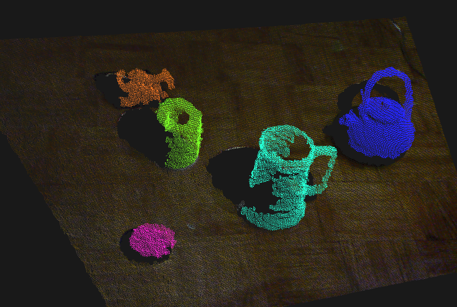

Segment the objects from the plane, color them
==============================================

:download:`colorize_clusters.py`

.. literalinclude:: colorize_clusters.py

.. ectoplot:: colorize_clusters.py plasm

